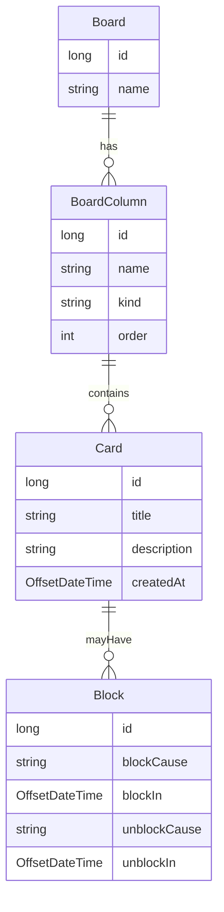

Diagrama de Classe utilizada para o Projeto Board 

```mermaid
erDiagram
    Board {
        long id
        string name
    }

    BoardColumn {
        long id
        string name
        string kind
        int order
    }

    Card {
        long id
        string title
        string description
        OffsetDateTime createdAt
    }

    Block {
        long id
        string blockCause
        OffsetDateTime blockIn
        string unblockCause
        OffsetDateTime unblockIn
    }

    Board ||--o{ BoardColumn : has
    BoardColumn ||--o{ Card : contains
    Card ||--o{ Block : mayHave
```

